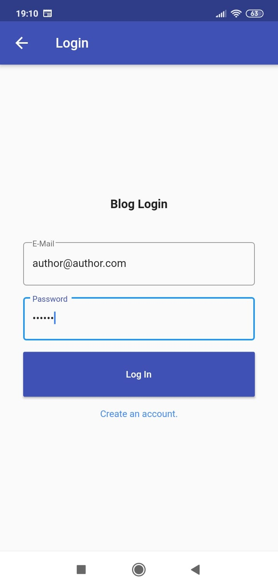
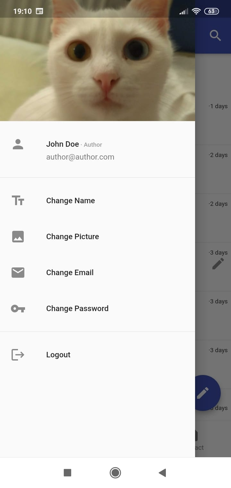
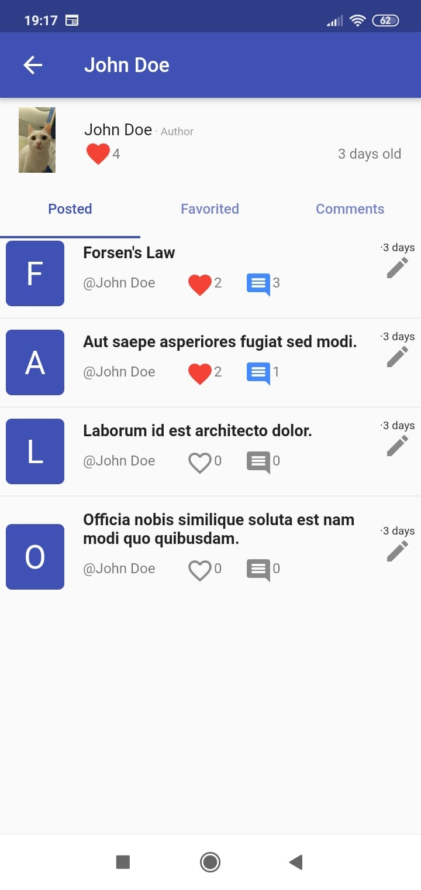
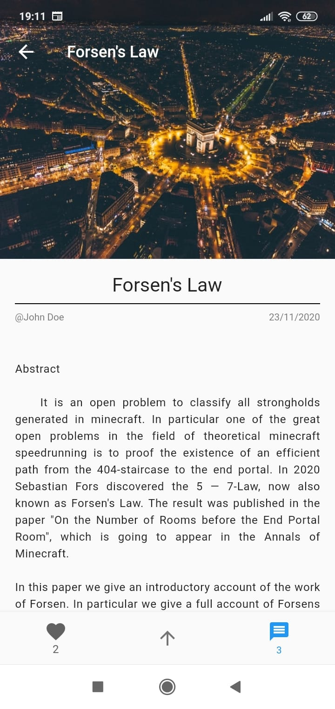
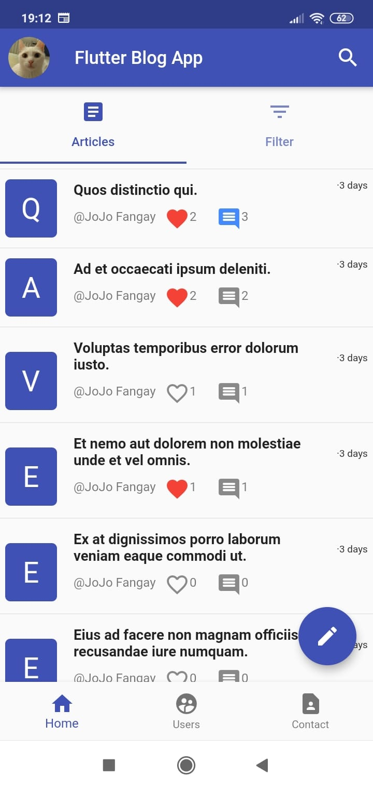
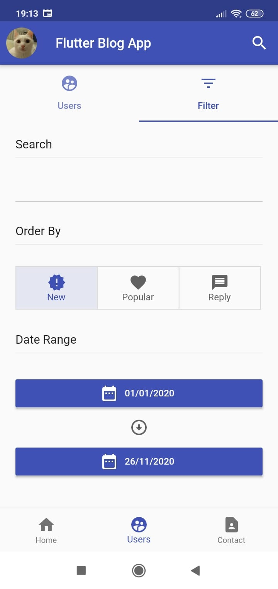

# Flutter Blog App

Simple flutter blog-like CRUD app that uses an external REST-API. 
API was developed in GO and you can access it from [here](https://github.com/Descrout/go-blog). Provider was used as a state management solution.

||||
|--|--|--|
||||

The app handles:

* Login.
* Registration.
* Changing user fields including: name, email, password and profile picture.
* Lazy loads articles/users/comments from a paginated API.
* Filtering articles and users.
* Creating articles/comments.
* Editing articles/comments.
* Deleting articles/comments.
* Favoriting articles.
* User profiles.
* Logout.
